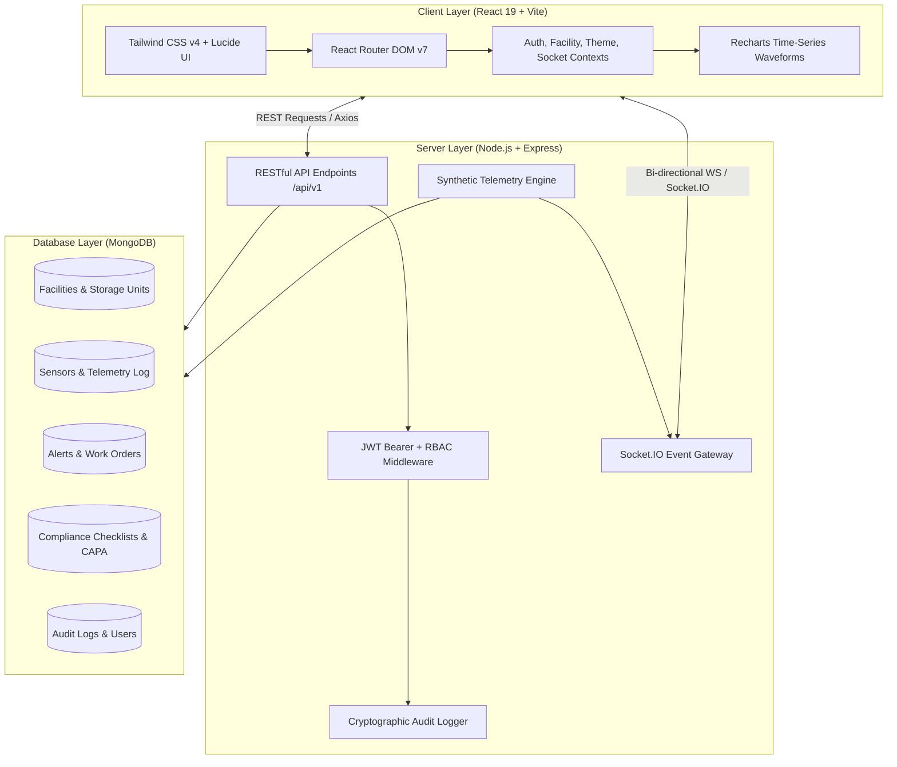

# HydroSentinel 🛡️⚡
### Hydrogen Storage Facility Monitoring, Maintenance & Safety Compliance Platform
> **Final-Year Engineering Capstone Project | Full-Stack MERN Architecture**

---

Website URL:

https://hydrosentinel-h2.vercel.app/dashboard

---
## 📌 Executive Summary & Problem Statement
Hydrogen ($H_2$) storage facilities operate under extreme thermodynamic conditions (up to 700+ bar pressure, cryogenic temperatures as low as -253°C, and wide flammability limits of 4% to 75% in air). Minor seal micro-fractures, valve fatigue, thermal excursions, or sensor drift can rapidly propagate into hazardous events.

**HydroSentinel** is an enterprise-grade Industrial IoT (IIoT) monitoring, preventive maintenance dispatch, and safety compliance platform designed for hydrogen bulk storage facilities, terminal manifolds, and dispensing depots. It provides:
1. **Real-Time Telemetry Streaming:** Multi-sensor ingest (Pressure, Temperature, Flame UV/IR, Catalytic Bead/PPM gas sensors) over Socket.IO WebSockets.
2. **Deterministic Alarm Engine:** Threshold breach detection across Warning and Critical bands with Mean-Time-To-Acknowledge (MTTA) tracking.
3. **Preventive & Corrective Maintenance:** Digital work orders, dynamic task checklists, technician sign-offs, and calendar schedules.
4. **Safety & Statutory Compliance:** Digital audit protocols (ISO 19880-1, NFPA 2, OSHA 1910.103), standard operating procedures (SOP), and Corrective & Preventive Action (CAPA) tracking.
5. **Tamper-Evident System Audit Trail:** Immutable logging of user authentications, threshold modifications, and work order transitions.

---

## ⚠️ Safety Boundary & Demonstration Simulation Model
> [!IMPORTANT]  
> **Monitoring & Decision-Support Only:** HydroSentinel is strictly an analytical monitoring and compliance platform. In accordance with industrial safety mandates, **no physical valve actuation, vent control, or compressor controls are connected to this web stack**. All emergency isolations must follow on-site physical lock-out/tag-out (LOTO) protocols and on-premises Safety Instrumented Systems (SIS).

To facilitate end-to-end demonstrations without physical gas hardware, HydroSentinel includes an internal **Synthetic Telemetry Simulation Engine** that models thermodynamic conditions across high-pressure and cryogenic vessels. Real-time conditions and simulated failure modes (e.g. Flange Leaks, Pressure Compression Surges, Thermal Excursions, Sensor Drift) can be triggered on demand via the Simulator Control Center.

---

## 🏛️ System Architecture



---

## 👥 Role-Based Access Control (RBAC) & Demo Credentials

The platform is pre-seeded with 5 enterprise roles. One-click demo login buttons are available on the login screen (`http://localhost:3000/login`).

| Role | Demo Email | Password | Primary Permissions & Capabilities |
| :--- | :--- | :--- | :--- |
| **Super Admin** | `admin@hydrosentinel.io` | `Hydrogen@2026` | Full platform control, user provisioning, global simulator config, audit inspection |
| **Facility Manager** | `manager@hydrosentinel.io` | `Hydrogen@2026` | Facility directory, storage unit management, work order dispatch, analytics |
| **Safety Officer** | `safety@hydrosentinel.io` | `Hydrogen@2026` | Alert acknowledgment/triage, compliance checklists, safety documents, CAPA |
| **Maintenance Tech**| `tech@hydrosentinel.io` | `Hydrogen@2026` | Field work order execution, interactive checklist toggles, sensor calibration |
| **Viewer** | `viewer@hydrosentinel.io` | `Hydrogen@2026` | Read-only telemetry monitoring, reports, safety document viewing |

---

## ⚡ Quickstart & Local Installation

### Prerequisites
- **Node.js** (v18.0.0 or higher)
- **npm** (v9.0.0 or higher)
- **MongoDB** (v6.0 or higher running on port `27017`)

### 1. Repository Setup
```bash
git clone <repo-url> hydrosentinel
cd hydrosentinel
```

### 2. Install Dependencies
```bash
npm run install:all
```
*(Or install manually: `cd server && npm install`, then `cd client && npm install`)*

### 3. Environment Configuration
Copy environment templates in both root and server:
```bash
cp server/.env.example server/.env
```
Ensure `server/.env` contains:
```env
PORT=5001
NODE_ENV=development
MONGODB_URI=mongodb://localhost:27017/hydrosentinel
JWT_SECRET=hydrosentinel_capstone_super_secure_jwt_secret_2026
JWT_EXPIRES_IN=7d
CLIENT_URL=http://localhost:3000
```

### 4. Seed the Database (Initial Setup)
Populates the 7 Indian Green Hydrogen Hubs, storage vessels, transducers, historical points, work orders, compliance checklists, SOP documents, and demo users:
```bash
npm run seed
```

### 5. 1-Click Startup (Standalone in VS Code / Terminal)
You do not need Antigravity open. Run this single command from your project root:
```bash
./start.sh
# or: npm start
```
This automatically:
1. Starts **MongoDB** daemon in the background
2. Starts the **Backend API** (Port 5001)
3. Starts the **React Frontend** (Port 3000)
4. Opens your browser to **`http://localhost:3000`** automatically!

*(To stop all servers at any time, simply press `Ctrl + C` in that terminal).*

---

## 🧪 Testing & Validation Suite

The backend includes a comprehensive integration test suite written with **Vitest** and **Supertest**, verifying all 7 core modules:
```bash
npm run test:server
```
**Test Coverage Includes:**
- `Authentication & Security Middleware`: 401 unauthenticated guard, credential validation, `/auth/me` identity.
- `Facility Management APIs`: Site listings, nested vessel & sensor topology.
- `Sensor & Telemetry APIs`: Live telemetry ingestion with simulation flags, sensor inventory.
- `Alert Lifecycle Management`: Triage workflow, status transitions, SLA timestamps.
- `Maintenance Work Orders`: Creation, checklist execution, technician closure notes.
- `Safety & Compliance Workflows`: Checklists, score calculation, regulatory registers.
- `Executive Analytics & CSV Export`: Aggregated KPIs, MTTA/MTTR metrics, blob CSV stream.

To validate frontend production bundling:
```bash
npm run build:client
```

---

## 📂 Project Directory Structure

```
HydroSentinel/
├── client/                     # Frontend Application (React 19 + Vite + Tailwind v4)
│   ├── src/
│   │   ├── components/         # Reusable Component Library
│   │   │   ├── common/         # Button, Card, Badge, Modal, Table, Input, Tabs
│   │   │   ├── layout/         # AppLayout, Sidebar, Navbar, GlobalSearchModal
│   │   │   ├── monitoring/     # SensorCard, TelemetryChart
│   │   │   └── alerts/         # EmergencyNotice
│   │   ├── contexts/           # Auth, Facility, Socket, Notification, Theme
│   │   ├── pages/              # 25 Dedicated Application Views
│   │   │   ├── facilities/     # Directory, Detail, StorageUnit
│   │   │   ├── monitoring/     # Live Mission Control Telemetry
│   │   │   ├── sensors/        # Sensor Inventory, Transducer Detail
│   │   │   ├── alerts/         # Alert Center, Alert Incident Details
│   │   │   ├── maintenance/    # Maintenance Dashboard, Work Orders, Calendar
│   │   │   ├── compliance/     # Checklists, Safety Docs, CAPA Register
│   │   │   ├── analytics/      # MTTA/MTTR Trends, CSV Export, Print Report
│   │   │   ├── settings/       # Telemetry Simulator Control Center
│   │   │   └── users/          # RBAC User Management & Provisioning
│   │   ├── services/           # Axios API Client & Socket.IO Client
│   │   └── routes/             # AppRoutes with RBAC Protected Routes
│   └── vite.config.js          # Vite config with @tailwindcss/vite & 5001 Proxy
│
├── server/                     # Backend API & Physics Simulator (Node.js + Express)
│   ├── src/
│   │   ├── config/             # Database connection & System constants
│   │   ├── controllers/        # 14 RESTful Controllers
│   │   ├── middleware/         # Auth, RBAC, Validator, Audit Logger
│   │   ├── models/             # 15 Mongoose Schemas with Validations
│   │   ├── routes/             # Express 5.0 Router Modules
│   │   ├── simulator/          # Multi-scenario Synthetic Telemetry Engine
│   │   ├── sockets/            # Authenticated WebSocket Gateway
│   │   └── app.js              # Express app setup & CORS configuration
│   ├── scripts/seed.js         # Comprehensive Enterprise Data Seeder
│   └── tests/api.test.js       # Vitest Integration Test Suite
│
├── docs/                       # Technical Documentation & Diagrams
│   ├── architecture.md
│   ├── simulation_model.md
│   └── safety_compliance.md
└── package.json                # Root orchestration scripts
```

---

## 📜 Regulatory Standards Alignment
- **ISO 19880-1:2020**: Gaseous hydrogen fueling stations — General requirements.
- **NFPA 2 (2023 Edition)**: Hydrogen Technologies Code (Storage, Piping, Venting, Safety distances).
- **OSHA 29 CFR 1910.103**: Standard for Hydrogen Storage Systems.
- **CGA G-5.5**: Hydrogen Vent Systems.

---

## 🎓 Capstone Authors & Acknowledgments
Developed as a Final-Year Engineering Capstone Project demonstrating advanced Full-Stack Web Architecture, Industrial Safety Instrumentation, Real-time WebSockets, and Distributed Data Engineering.
